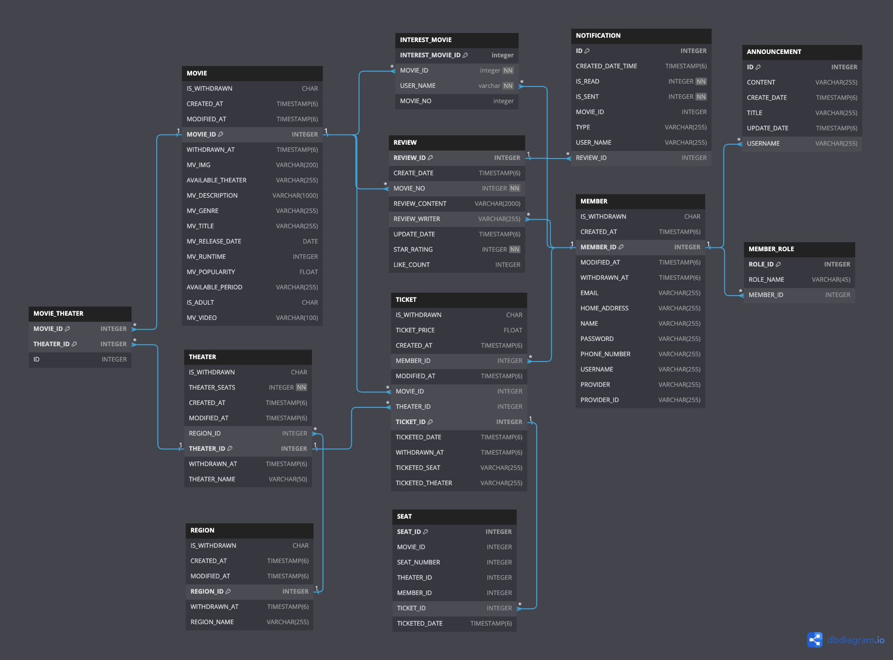

# 에드인에듀 - 영화 예매 웹사이트

## Members

김지창, 백세진, 안정선  

## Project duration

2024.1.27 ~ 2024.2.19 (3주)

## Overview

영화 예매 사이트를 springboot + jsp + oracle을 활용하여 구현한다

## Goals

1. 가입 기능  
2. 영화 예매  
3. 예매한 내역 조회 가능한 마이페이지  
4. 영화별 리뷰 게시판

## Assigned Tasks

### 김지창
- 프로젝트 아키텍처 설계
- 영화 TMDB API 적용
- 티켓팅, 관리자 페이지
- 코드 병합

### 백세진
- 회원가입, 로그인, 마이페이지
- 소셜 로그인
- 영화 목록 조회 및 검색
- 영화 상세페이지

### 안정선
- 알림, 좋아요, 관심영화
- 영화 카테고리별 조회
- 공지사항 페이지

## Dev Envs and Tech Stacks

### Back-End

JAVA 17  
Spring boot 3.0.2

### Front-End

JSP  
JQeury

### IDE

IntelliJ  

### Communication

Notion  
Discord

### DB

Oracle(synology docker를 통해 배포)

## ERD


## 폴더 구조
```
폴더 구조
```
