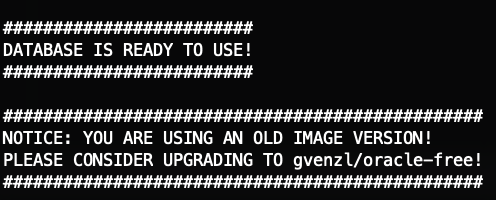

# MoVie Cinema - 영화 예매 웹사이트
기존의 댓글 리뷰만 되는 사이트들과는 달리 리뷰를 중심으로 사람들과 소통이 가능한 **영화 커뮤니티 웹**

> [!Important]
> 구글, 카카오, 네이버 소셜 로그인 적용으로 총 세 개의 API 키가 필요합니다  
> 다음 공식 문서들을 따라 키를 발급 받은뒤 뒤의 실행 절차를 따라 주세요  
> - [Google login API](https://developers.google.com/identity/gsi/web/guides/get-google-api-clientid?hl=ko)
> - [Kakao Rest API key, Client Secret](https://developers.kakao.com/docs/latest/ko/kakaologin/rest-api)
> - [Naver Client ID, Client Secret](https://developers.naver.com/products/login/api/api.md)

## Features 

### 로그인 페이지
  - 구글, 네이버, 카카오 소셜 로그인
  - 회원가입
### 메인 페이지
  - 관심영화 TOP5, 무비 차트(인기순), 이벤트, 베스트 리뷰
  - 공지사항 게시판 
### 마이 페이지
  - 개인 정보 조회, 내 정보 수정, 비밀번호 재설정, 회원 탈퇴
  - 예매 내역 조회
  - 내 리뷰 보기, 내 관심 영화 
### 관리자 페이지
  - 회원 관리
  - 공지사항 등록 
### 영화 페이지
  - 영화 목록
    - 카테고리 별 조회
    - 영화 상세 보기
  - 영화 세부내용
    - 별점 및 리뷰 작성
    - 좋아요 기능
    - 최신순, 좋아요 순 정렬
    - 관심 영화 추가
  - 티켓팅
    - 지역, 영화관, 날짜, 시간, 좌석 선택
    - 카카오 페이 결제

## System Requirements

- Mac OS: macOS 10.9 (Mavericks) 이상
- Windows 10 : 1607 Anniversary Update, Build 14393 이상(Window Home 1903 이상)
- Linux: 커널 버전 3.10 이상을 권장(Ubuntu 18.04 LTS 이상, CentOS 7 이상, Debian 9 이상 등)

## Getting Started

### 사전 요구사항
> [!Note]
> 이 프로젝트는 Docker와 Docker Compose를 사용하여 로컬 환경에서 쉽게 실행할 수 있도록 구성되어 있습니다.    
> Docker 설치 방법은 [Docker 공식 문서](https://docs.docker.com/desktop/)를 참조하세요.

> [!Note]
> 현재 ARM 칩셋을 위한(애플 M칩) 포트가 없어, Oracle XE 이미지를 실행할 수 없습니다. colima와 같은 기술을 사용하면 이러한 이미지를 사용할 수 있습니다. 실행 단계는 다음과 같습니다.
> - colima 설치하기 [instructions](https://github.com/abiosoft/colima#installation)
> - 터미널에서 `colima start --arch x86_64 --memory 4`
> - 컨테이너 실행하기

### 설치 및 실행 단계

1. **프로젝트 클론**

   Git을 사용하여 이 프로젝트를 로컬 시스템으로 클론합니다.
    ```bash
    git clone https://github.com/Addin-CJS/movie-cinema
    cd movie-cinema
    ```

1. **구글 클라우드 서비스키 설정**
   
    **[docker-compose.yml]**
    ```
    GOOGLE_CLIENT_ID='비밀키를 설정해주세요' 
    GOOGLE_CLIENT_SECRET='비밀키를 설정해주세요' 
    KAKAO_CLIENT_ID='비밀키를 설정해주세요' 
    KAKAO_CLIENT_SECRET='비밀키를 설정해주세요' 
    NAVER_CLIENT_ID='비밀키를 설정해주세요' 
    NAVER_CLIENT_SECRET='비밀키를 설정해주세요'
    ```
    공식문서를 따라 발급받은 키들을 적용해야합니다. 각 OS에 따른 텍스트 편집기를 사용해 `docker-compose.yml` 파일의 '비밀키를 설정해주세요' 부분을 수정합니다. 

1. **Docker 이미지 빌드 및 컨테이너 실행**

   Docker Compose를 사용하여 서비스를 빌드하고 실행합니다.
    ```bash
    docker-compose up --build
    ```
   빌드가 완료되고 컨테이너가 실행되면, Oracle 서버와 애플리케이션이 실행됩니다.
   오라클 서버는 실행 성공시 다음과 같은 이미지를 출력합니다.  
   

1. **웹사이트 접속**
   
   브라우저를 열고 `http://localhost:9999`로 접속합니다. 애플리케이션의 홈페이지가 표시됩니다.

## Architecture


## Folder Structure
```
├── LICENSE                       # 프로젝트 라이선스 정보 파일
├── README.md                     # 프로젝트 설명 및 사용 방법이 담긴 문서
├── app                           # 애플리케이션의 주요 소스 코드 및 설정 파일 디렉토리
│   ├── Dockerfile                # Docker 컨테이너 빌드를 위한 설정 파일
│   ├── README.md                 # 애플리케이션 디렉토리 설명 문서
│   │   └── resources             # 애플리케이션 리소스 파일 디렉토리
│   │      └── main               # 메인 리소스 파일 디렉토리, 설정 파일 및 정적 자원 포함
│   │         ├── application.properties  # 애플리케이션 설정 파일
│   │         └── static          # 웹 애플리케이션의 정적 자원 디렉토리
│   ├── build.gradle              # Gradle 빌드 설정 파일
│   ├── gradle                    
│   │   └── wrapper               
│   │       ├── gradle-wrapper.jar        # Gradle Wrapper 실행 파일
│   │       └── gradle-wrapper.properties # Gradle Wrapper 설정 파일
│   ├── gradlew                   # Gradle Wrapper 실행 스크립트 (리눅스/유닉스)
│   ├── gradlew.bat               # Gradle Wrapper 실행 스크립트 (윈도우)
│   ├── settings.gradle           # Gradle 프로젝트 설정 파일
│   └── src                       # 소스 코드 디렉토리
│       ├── main                  # 애플리케이션 메인 소스 코드 디렉토리
│       │   ├── java              # Java 소스 파일 디렉토리
│       │   │   └── com
│       │   │       └── dealim
│       │   │           ├── AddinTeam4Application.java  # 스프링 부트 애플리케이션 시작점
│       │   │           ├── controller      # 웹 요청 처리 컨트롤러 클래스
│       │   │           ├── domain          # 도메인 모델 클래스
│       │   │           ├── dto             # 데이터 전송 객체 클래스
│       │   │           ├── repository      # 데이터 접근 객체 인터페이스
│       │   │           ├── scheduler       # 스케줄링 작업 클래스
│       │   │           ├── security        # 보안 관련 설정 및 클래스
│       │   │           ├── service         # 비즈니스 로직 서비스 클래스
│       │   │           └── util            # 유틸리티 클래스
│       │   ├── resources       # 애플리케이션 리소스 파일 디렉토리
│       │   └── webapp          # 웹 애플리케이션 리소스 디렉토리
│       │       └── WEB-INF     # WEB-INF 디렉토리, 뷰 템플릿 등 포함
│       └── test                # 테스트 코드 디렉토리
│           └── java            # Java 테스트 소스 파일 디렉토리
├── assets                       # 프로젝트 자산 파일 디렉토리, 예: ERD 다이어그램
│   └── ERD.png                  # 데이터베이스 ERD 다이어그램 이미지
├── docker-compose.yml           # Docker 컴포즈 설정 파일, 컨테이너 오케스트레이션용
├── docs                         # 프로젝트 문서화 파일 디렉토리
└── oracle                       # Oracle 데이터베이스 관련 파일 디렉토리

```
## Roles
[팀원 역할](./docs/ROLES.md)

## LICENSE
MIT License Copyright (c) 2024 Addin-CJS
